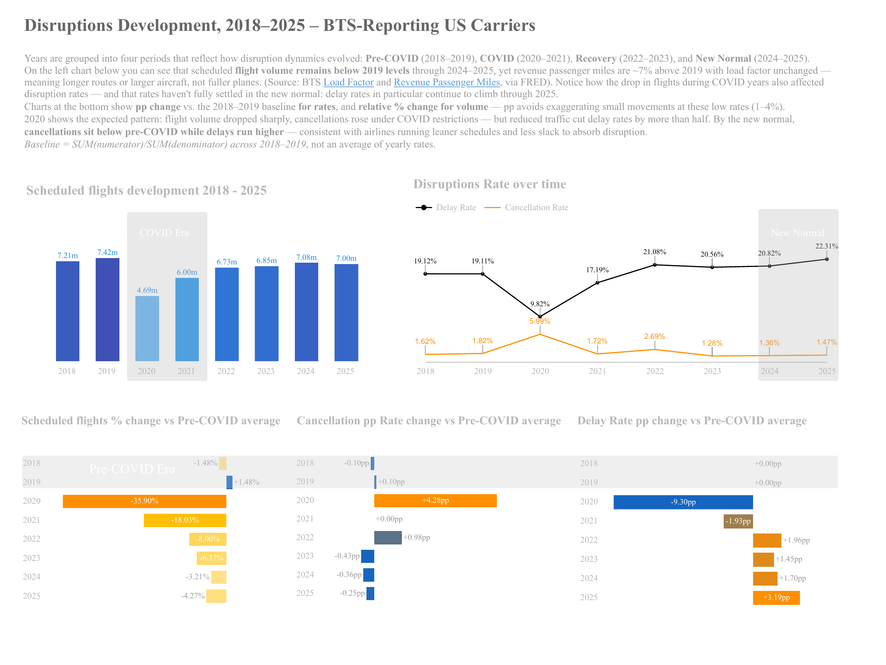
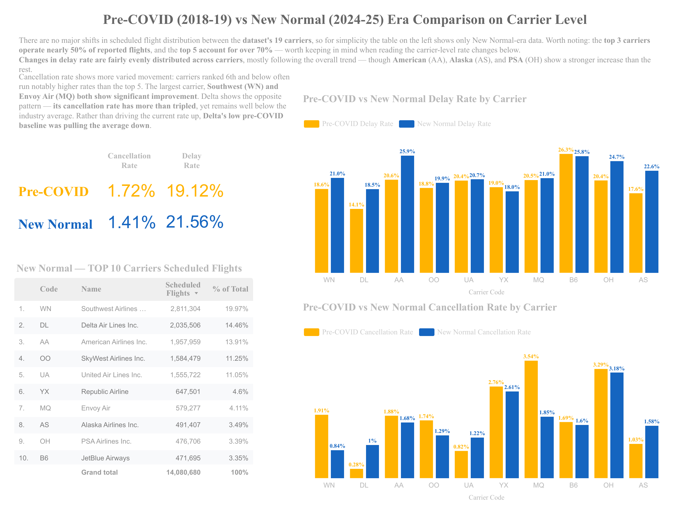
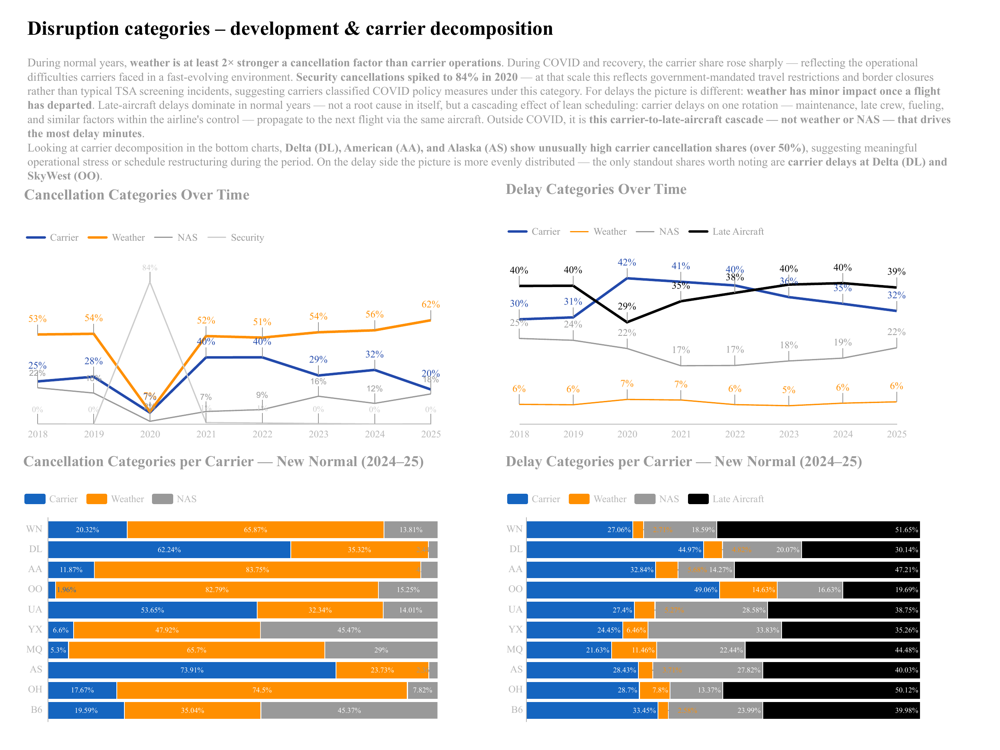
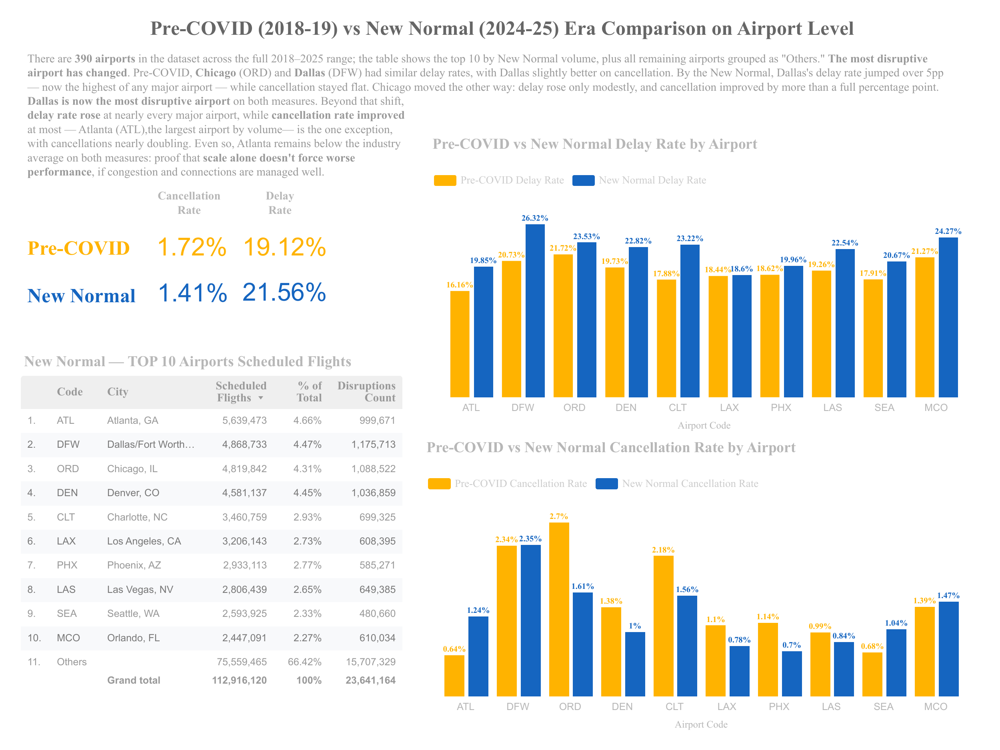
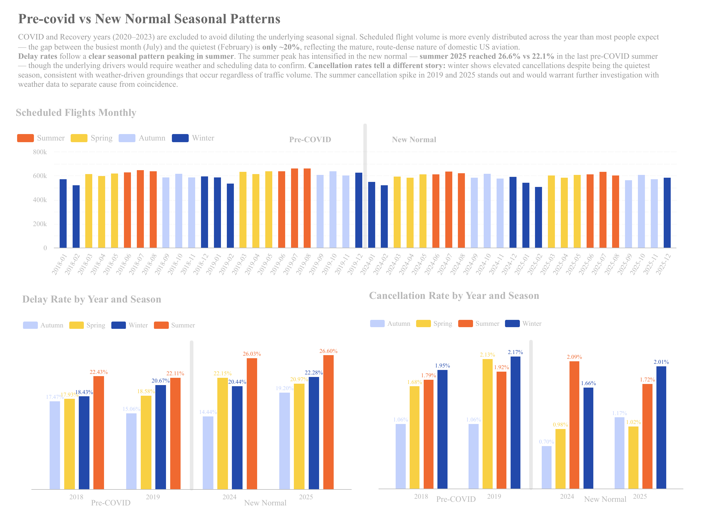
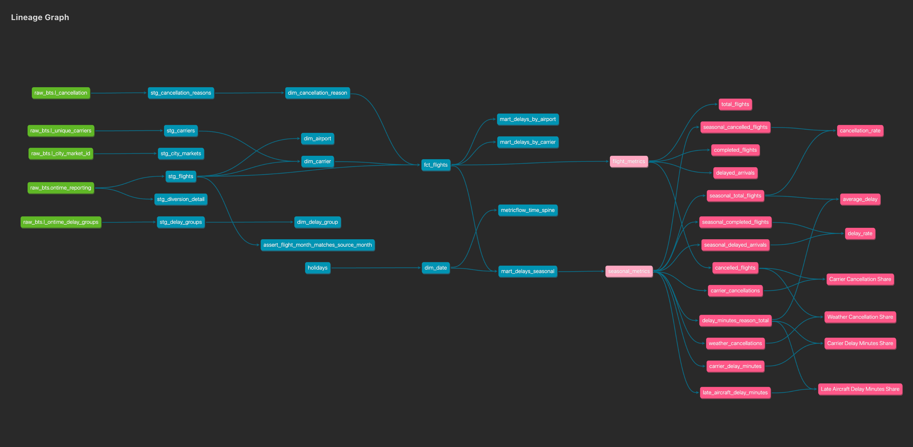

# US Flight Delays Pipeline

End-to-end data pipeline analysing **55 million+ US domestic flights** (2018–2025)
from the Bureau of Transportation Statistics. Ingests monthly extracts through Airflow,
lands them as Hive-partitioned Parquet in a GCS data lake, loads them into BigQuery
via external tables, transforms them into a star schema with dbt, and serves the
results through a Data Studio dashboard.

**Stack:** Airflow · dbt · BigQuery · GCS · Terraform · Data Studio · MetricFlow

## Dashboard

The pipeline feeds a five-page Data Studio dashboard covering 55 million+ US domestic
flights across 19 BTS-reporting carriers and 390 airports. Years are grouped into four
eras — Pre-COVID (2018–2019), COVID (2020–2021), Recovery (2022–2023), New Normal
(2024–2025) — drawn from confirmed volume data rather than assumption.

> 📥 [Download the full dashboard (PDF)](docs/dashboard_us_flight_disruptions_2018_2025.pdf)



The headline finding: the industry got better at not cancelling flights but worse at
flying them on time. Cancellation rates sit below pre-COVID levels (~1.4% vs ~1.7%),
while delay rates climbed from ~19% to ~22% — a structural shift, not a COVID hangover.
Flight volume remains below 2019 levels, yet revenue passenger miles are ~7% above 2019
with load factor unchanged — meaning longer routes or larger aircraft, not fuller planes.

*Click any section below to expand the remaining dashboard pages ↓*

<details>
<summary><strong>Carrier-level comparison</strong> — Pre-COVID vs New Normal</summary>

<br>



The top 3 carriers (Southwest, Delta, American) operate nearly 50% of reported flights;
the top 5 account for over 70%. Delay rate increases are fairly evenly distributed across
carriers, but cancellation rates tell a different story: Delta's cancellation rate more than
tripled yet remains well below industry average — its low pre-COVID baseline was pulling
the average *down*. Southwest and Envoy Air both show significant improvement. Carriers
ranked 6th and below often run notably higher cancellation rates than the top 5.

</details>

<details>
<summary><strong>Disruption categories</strong> — causes over time and by carrier</summary>

<br>



During normal years, weather is at least 2× stronger a cancellation factor than carrier
operations. For delays the picture is different: late-aircraft delays dominate — not a
root cause in itself, but a cascading effect of lean scheduling where carrier delays on
one rotation (maintenance, late crew, fueling) propagate to the next flight via the same
aircraft, generating the most delay minutes. Delta, American, and Alaska show unusually
high carrier cancellation shares (over 50%), suggesting meaningful operational stress or
schedule restructuring.

</details>

<details>
<summary><strong>Airport-level comparison</strong> — Pre-COVID vs New Normal</summary>

<br>



390 airports across the full date range. The most disruptive airport has changed: pre-COVID,
Chicago (ORD) and Dallas (DFW) had similar delay rates. By the New Normal, Dallas's delay
rate jumped over 5pp — now the highest of any major airport. Atlanta (ATL), the largest
airport by volume, kept delay rate increases modest — proof that scale alone doesn't force
worse performance if congestion and connections are managed well. Cancellation rates
improved at most major airports; Atlanta is the one exception, with cancellations nearly
doubling, though still below the industry average.

</details>

<details>
<summary><strong>Seasonal patterns</strong> — Pre-COVID vs New Normal</summary>

<br>



COVID and Recovery years excluded to avoid diluting the seasonal signal. The summer delay
peak has intensified in the New Normal — summer 2025 reached 26.6% vs 22.1% pre-COVID,
a 4.5pp gap confirming the structural nature of the increase. The system runs closer to
capacity year-round, and summer peaks expose it. Winter shows elevated cancellations despite
being the quietest season, consistent with weather-driven groundings that occur regardless
of traffic volume. Scheduled flight volume is more evenly distributed across months than
most expect — the busiest-to-quietest gap is only ~20%.

</details>

---

## Architecture




Three Airflow DAGs form the pipeline:

| DAG | Schedule | Purpose |
|---|---|---|
| `bts_ontime_reporting` | `@monthly`, catchup from 2018-01 | Downloads monthly ZIP from BTS, validates the 109-column schema, converts to Parquet in memory, uploads to GCS with idempotent skip |
| `bts_lookups` | `@monthly` | Fetches all 18 BTS reference tables in parallel via dynamic task mapping |
| `dbt_build` | Triggered by ingestion | Runs `dbt build --target prod` — chained via `TriggerDagRunOperator`, skippable during backfills with `--conf '{"skip_dbt": true}'` |

---

## Data Model

dbt transforms raw BTS data into a star schema across three layers:

```
staging (views)              core (tables)              marts (tables)
─────────────────           ─────────────────          ─────────────────
stg_flights            ───► fct_flights           ───► mart_delays_by_carrier
stg_diversion_detail        dim_airport                mart_delays_by_airport
stg_carriers           ───► dim_carrier                mart_delays_seasonal
stg_cancellation_reasons──► dim_cancellation_reason
stg_delay_groups       ───► dim_delay_group
stg_city_markets            dim_date (generated spine)
```



**`fct_flights`** — one row per operated flight leg, joining staging to dimension
tables. Carries delay minutes by cause, a `flight_outcome` classification
(see [Data Quality Notes](#data-quality-findings) §6), and a `travel_era` column
segmenting the data into pre-COVID / COVID / recovery / new-normal periods.

**`dim_date`** — generated date spine (1987–2050) with seasons, US federal holidays
(via Python `holidays` package seed), and travel eras. Independent of loaded data
so it supports gap analysis.

**Mart design** — rates (cancellation rate, delay rate) are deliberately *not*
pre-computed. Marts store counts and totals; the BI layer computes
`SUM(numerator) / SUM(denominator)` so ratios re-aggregate correctly at any grain.
This avoids the classic averaging-averages bug.

### Semantic Layer (MetricFlow)

Seven ratio metrics defined via dbt's MetricFlow, verified against the dashboard
via `mf query`:

| Metric | Definition |
|---|---|
| `cancellation_rate` | cancelled flights / total flights |
| `delay_rate` | delayed arrivals / completed flights |
| `average_delay` | total delay minutes / total flights |
| `carrier_cancellation_share` | carrier-caused cancellations / all cancellations |
| `weather_cancellation_share` | weather cancellations / all cancellations |
| `carrier_delay_share` | carrier delay minutes / total delay minutes |
| `late_aircraft_delay_share` | late aircraft delay minutes / total delay minutes |

Not wired to a BI tool (requires dbt Cloud's semantic layer API) — included as a
demonstration of governed metric definitions that re-aggregate correctly at any grain.

---

## Data Quality Findings

The pipeline development included systematic investigation of the source data.
Full write-ups are in [`docs/data_quality_notes.md`](docs/data_quality_notes.md);
highlights below.

**Schema stability** — column set verified stable (110 columns, 109 after dropping
the phantom trailing-comma column) across 2015–2026 samples. Ingestion pins explicit
dtypes and fails loudly on any deviation.

**No codeshare duplication** — investigated whether 14 CFR §234.4(k) marketing-carrier
filing requirements create duplicate rows. Tested against a physical-flight fingerprint
`(FlightDate, Tail_Number, Origin, Dest, CRSDepTime)` — **zero duplicates** across
541,978 flights (January 2024). Regional carriers already file independently.

**`flight_outcome` classification** — discovered that `DivAirportLandings = 9` is a
BTS sentinel value marking cancelled flights that had in-transit diversion events.
This led to a five-level `flight_outcome` column (`completed`, `diverted`,
`cancelled_before_pushback`, `cancelled_after_pushback`, `cancelled_after_departure`)
that captures cancellation severity — operationally, "never left the gate" and "was
airborne, turned back" are very different events.

**Diversion detail scope** — `stg_diversion_detail` deliberately does *not* filter
on `Diverted = 1`, because doing so would exclude real diversion events whose parent
row reports `Diverted = 0` due to ultimate cancellation.

**BTS URL encoding** — BTS obfuscates download URLs with a custom rotation cipher
across a 62-character alphabet (digits + uppercase + lowercase), which is *not*
standard ROT13. The pipeline reverse-engineers this to construct lookup table URLs
programmatically. See `bts_encode()` / `bts_decode()` in
[`airflow/dags/bts_lookups.py`](airflow/dags/bts_lookups.py).

### dbt Tests

33 tests run on every `dbt build`, covering all three layers:

| Test type | Count | Purpose |
|---|---|---|
| `not_null` | 14 | Every primary key and critical attribute is non-nullable |
| `unique` | 9 | Primary keys verified unique across all dimensions, fact table, staging models, and the holiday seed |
| `accepted_values` | 5 | Enum columns constrained — `flight_outcome` (6 values), `delay_pattern` (4 values), `season` (4 values), airport `direction` |
| `relationships` | 4 | Referential integrity from `fct_flights` to all four joined dimensions (`dim_carrier`, `dim_cancellation_reason`, `dim_airport` × 2) |
| Singular | 1 | `assert_flight_month_matches_source_month` — validates that flight dates match the BTS source file's partition month/year, catching misreported records |

Tests are defined alongside models in schema YAML files (`_staging__models.yml`,
`_core__models.yml`, `_marts__models.yml`) so documentation and contracts live in
one place. The singular test lives in `dbt/flights/tests/`.

---

## Project Structure

```
.
├── airflow/
│   ├── dags/
│   │   ├── bts_ontime_reporting.py   # Monthly flight data ingestion
│   │   ├── bts_lookups.py            # 18 BTS reference tables (dynamic tasks)
│   │   ├── dbt_build.py              # dbt deps + build (triggered)
│   │   └── include/                  # Schema definitions
│   ├── config/                       # GCP credentials, dbt profile (gitignored)
│   ├── Dockerfile                    # Extends apache/airflow:3.3.0
│   └── requirements.txt              # airflow-providers-google, dbt-core, etc.
├── dbt/flights/
│   ├── models/
│   │   ├── staging/                  # 6 models — cleaned, typed, conformed (views)
│   │   ├── core/                     # 5 dims + 1 fact table + semantic model
│   │   └── marts/                    # 3 aggregates + semantic metrics
│   ├── macros/                       # generate_schema_name
│   ├── seeds/                        # holidays.csv (2000–2050 US federal holidays)
│   └── dbt_project.yml
├── terraform/
│   └── main.tf                       # GCS bucket, BigQuery datasets, external tables
├── notebooks/                        # Exploratory analysis of source data
├── docs/
│   ├── images/                       # Dashboard pages, lineage graph, architecture
│   ├── data_quality_notes.md         # Investigation findings
│   └── bts_field_dictionary.md       # Column documentation
└── scripts/
    └── generate_holidays_seed.py     # Holiday seed generator (Python holidays package)
```

---

## Infrastructure

Terraform provisions all GCP resources:

- **GCS bucket** with 90-day lifecycle policy
- **BigQuery datasets:** `raw_bts`, `flights_staging`, `flights_core`, `flights_marts`
- **External table** `raw_bts.ontime_reporting` with Hive partitioning on
  `source_year` / `source_month` — queries filtered on these columns scan only
  the relevant Parquet files
- **Lookup external tables** via `for_each` over four modelled reference tables

Partition keys are named `source_year` / `source_month` (not `Year` / `Month`)
to avoid colliding with BTS's own columns of the same name — see
[data quality notes §3](docs/data_quality_notes.md#3-provenance-vs-source-columns).

---

## Setup

### Prerequisites

- Docker Desktop
- Terraform
- `gcloud` CLI, authenticated
- A GCP project with billing enabled

### 1. Clone

```bash
git clone git@github.com:filipburger/us-flight-delays-pipeline.git
cd us-flight-delays-pipeline
```

### 2. Provision GCP resources

Create a service account for Terraform with `roles/storage.admin` and
`roles/bigquery.admin`, generate its key, then:

```bash
cd terraform
terraform init
terraform plan
terraform apply
```

This creates the GCS data lake bucket and all four BigQuery datasets with
external tables.

### 3. Create the Airflow service account

Scoped to least privilege — writes objects and loads tables, but cannot create
or delete buckets or datasets:

```bash
export PROJECT_ID=<your-project-id>
export SA="airflow-runner@${PROJECT_ID}.iam.gserviceaccount.com"

gcloud iam service-accounts create airflow-runner \
  --project=$PROJECT_ID \
  --display-name="Airflow pipeline runner"

for ROLE in roles/storage.objectAdmin roles/bigquery.dataEditor roles/bigquery.jobUser; do
  gcloud projects add-iam-policy-binding $PROJECT_ID \
    --member="serviceAccount:${SA}" --role="$ROLE"
done

gcloud iam service-accounts keys create airflow/config/gcp-credentials.json \
  --iam-account=$SA
```

> `airflow/config/gcp-credentials.json` is gitignored and must be generated locally.

### 4. Start Airflow

```bash
cd airflow
curl -LfO 'https://airflow.apache.org/docs/apache-airflow/stable/docker-compose.yaml'
mkdir -p ./dags ./logs ./plugins ./config

echo "AIRFLOW_UID=$(id -u)" > .env
echo "FERNET_KEY=$(python -c 'from cryptography.fernet import Fernet; print(Fernet.generate_key().decode())')" >> .env

docker compose up airflow-init
docker compose up -d
```

The UI is at [http://localhost:8080](http://localhost:8080) (default login
`airflow` / `airflow`).

### 5. Configure the Airflow → GCP connection

In the Airflow UI: **Admin → Connections → +**

| Field | Value |
|---|---|
| Connection Id | `google_cloud_default` |
| Connection Type | Google Cloud |
| Keyfile Path | `/opt/airflow/config/gcp-credentials.json` |
| Project Id | your project ID |

### 6. Run the pipeline

```bash
# Backfill historical data (2018–2025), skip dbt during bulk load
airflow dags backfill bts_ontime_reporting \
  --start-date 2018-01-01 \
  --end-date 2025-12-01 \
  --conf '{"skip_dbt": true}'

# Trigger dbt build once backfill completes
airflow dags trigger dbt_build

# Future months run automatically via @monthly schedule
```

### 7. Connect Data Studio

Once dbt has built the mart tables, connect Data Studio (Looker Studio) to
BigQuery to build dashboards on top of the `flights_marts` dataset. See
[Connect to BigQuery](https://docs.cloud.google.com/data-studio/connect-to-google-bigquery)
in the official documentation.

---

## Production Considerations

This pipeline runs on a local Docker Compose stack for development and portfolio
purposes. A production deployment would replace this with one of the following
patterns, depending on team size, workload shape, and budget:

| Pattern | Use case | Expected cost (this pipeline) |
|---|---|---|
| **Cloud Composer** | Teams already on GCP that want managed Airflow with built-in monitoring, auto-scaling workers, and native GCS/BigQuery integration. Best when there are multiple pipelines and a team maintaining them — the operational overhead of patching, scaling, and HA is handled by Google. | ~$300–400/mo for a small environment (smallest Composer 2 config with 2 workers). Significant baseline cost makes it hard to justify for a single low-frequency pipeline, but cost-effective once you're running 10+ DAGs. |
| **Compute Engine VM + systemd** | Solo engineers or small teams running a stable, predictable workload where Composer's managed overhead isn't worth the cost. A single `e2-standard-2` VM runs Airflow via Docker Compose (same setup as this repo), with systemd ensuring the containers restart on reboot. Straightforward to operate — you own the VM, SSH in to debug, and pay a flat monthly rate. | ~$50–70/mo for an `e2-standard-2` (2 vCPU, 8 GB) running 24/7. The cheapest option for always-on Airflow, but you handle OS patches, disk monitoring, and restarts yourself. |
| **Cloud Run Jobs + Cloud Scheduler** | Serverless, pay-per-execution pattern — no always-on infrastructure. Each DAG becomes a container job triggered on a cron schedule. Ideal for sparse pipelines like this one (3 DAGs, monthly cadence) where the workload runs for minutes and then sits idle for weeks. Trade-off: no Airflow UI, no task dependencies or retry logic built in — you'd reimplement that in the job itself or accept simpler orchestration. | ~$1–5/mo — you pay only for the seconds each job runs. By far the cheapest option for a monthly pipeline, but loses Airflow's orchestration features (dependency graphs, backfill, UI). |

The dbt transformation layer is production-ready as-is — `dbt build --target prod`
runs identically regardless of where Airflow invokes it. The Terraform
configuration, GCS data lake, and BigQuery datasets are already
infrastructure-as-code and would carry over unchanged to any of these patterns.

---

## Acknowledgements

- Data source: [Bureau of Transportation Statistics — Reporting Carrier On-Time
  Performance](https://www.transtats.bts.gov/DL_SelectFields.aspx?gnoyr_VQ=FGJ&QO_fu146_anzr=b0-gvzr)
  (1987–present)
- Course framework: [DataTalks.Club Data Engineering Zoomcamp](https://github.com/DataTalksClub/data-engineering-zoomcamp)
